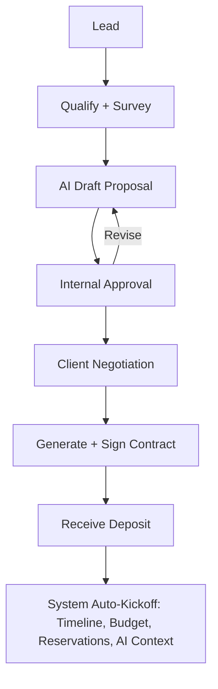

# Phase 1 & 5/6 Supplement: Detailed Business & System Workflows

**Reference:** Master Blueprint Phase 1 for universal lifecycle. This provides concrete, visual, multi-flow detail for the highest-frequency processes.

## Process 1: Lead → Contract → Kickoff (Core Revenue Flow)

**Business Flow (Actors + Decisions + Docs):**
1. Lead captured (Sales or self-serve form) → Actor: Sales / Owner. Document: Inquiry record.
2. Qualification call / site survey → Event Manager + Client. Doc: Survey notes + photos.
3. Draft Proposal (packages, high-level timeline, rough budget) → AI assist suggested. Doc: Proposal v1 (versioned).
4. Internal pre-approval (capacity / margin check) → Ops Director. Decision gate.
5. Send to Client + Negotiation rounds. Docs: Revised proposals.
6. Final internal approval (finance sign-off if > threshold) → Finance + Owner. Approval Flow.
7. Contract generation + e-signature → Legal/Owner + Client. Doc: Signed contract.
8. Deposit received → Finance. Trigger: System kickoff.

**User Flow (in product):**
Home → "New Lead" quick action → Capture form (smart fields from ICP) → "Create Proposal" → AI draft appears in editable canvas (timeline + budget preview) → Submit for internal approval (routes to Approvals) → Client portal link sent → Negotiation in comments + version compare → "Convert to Project" (one click after signatures + deposit).

**Approval Flow:**
- < $5k or standard package: Project Manager self-approve + Ops Director notification.
- > threshold or custom: Parallel — Ops (resources), Finance (margin), Owner (strategic).
- Mobile-optimized cards with context (client history, similar past margin).

**Communication Flow:**
Auto emails + in-app + client portal updates. "Proposal ready for your review" with direct link + summary.

**Finance Flow:**
Proposal stage: Soft budget created (not committed). Contract: Hard budget lines initialized. Deposit: Receipt logged, revenue recognition schedule created.

**System Flow (Invisible — exactly as Phase 6):**
On "Convert to Project":
- Create Project aggregate + Event if applicable (via handlers).
- Generate Timeline from best-match template + AI.
- Create Budget ledger (double-entry ready).
- Reserve rooms/equipment via Booking + Inventory handlers (conflict check mandatory).
- Initialize Tasks from checklist.
- Create Approval instances for any gated items.
- Seed Knowledge + RAG context.
- Activate notifications, realtime, dashboards.
- Outbox events for workers (e.g. welcome checklist, calendar sync).

**Exception Flow:**
Capacity conflict during proposal → AI surfaces alternatives + "Reserve tentatively" option. Escalates if none acceptable.

**Mermaid Diagram (simplified):**

(Full detailed versions for Wedding, Exhibition, Corporate, Production would be in industry packs.)

## Process 2: Resource Allocation & Conflict Resolution (Spatial + Inventory)

See current implementation (facilities, rooms, bookings, SubmitBookingHandler with 409 conflict).

**Business Additions:**
- Multi-resource bundles (room + AV + catering package).
- Time-windowed availability (move-in, teardown).
- Yield / overbooking rules per venue type (with human override).

**Flows:** Business (request → check → reserve/ waitlist), User (calendar picker + bulk), Approval (if policy), System (handler → outbox for notifications/workers), Exception (detect overlap → propose alternatives + impact).

## Process 3: Day-of Execution & Incident Management

**Command Center Screen Focus:**
Live map/calendar slice, crew status, access scan log, change request queue, client comms.

All other processes follow similar structure (detailed in full blueprint package).

**References back to Master + Existing:** Aligns with current bookings + approvals + access-passes domains. Extends them with full parallel flows.

Next: Add more Mermaid for approvals, finance close, etc. in revisions.
